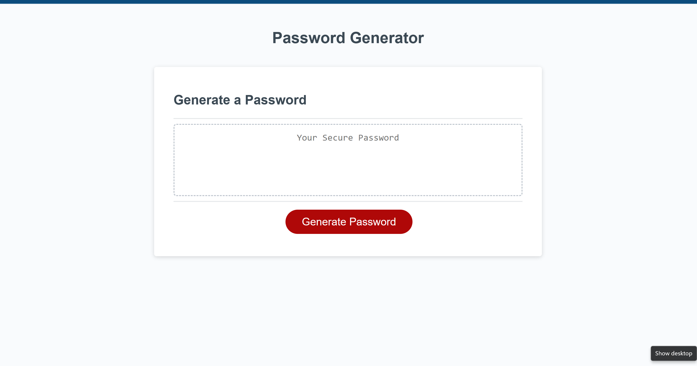

# JS_PasswordGenerator
Web Password Generator
## Describtion
Online web application for which I wrote script functions to validate user input and  generate password that confirms with user wishes.

### While working on this JavaScript challenge:
- I improved my understanding of JavaScript
- Practissed interasctivity of basic JS
- Futhered my function writting skills
- Implemented nested arrays, loops, IF ELSE statements
- called Math methods

## Usage
To use this online generator, we need to open the website, click on generate password and follow instructions in pop up alert, prompt and confirm moduluses. Then just copy the password and use!

## Screenshot
Here is how my application look like :

## Link
[Here](...) you can find my deployed application, enjoy!